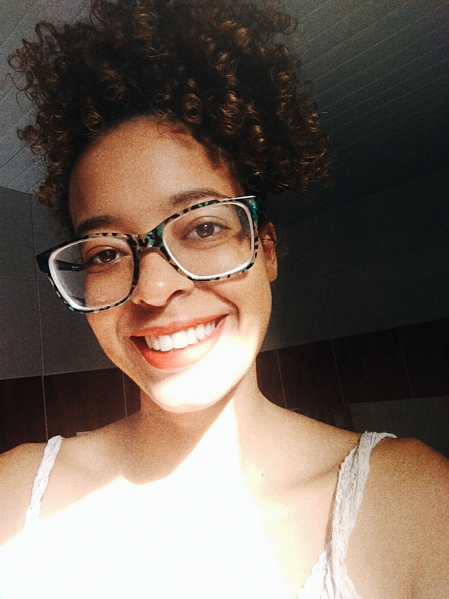
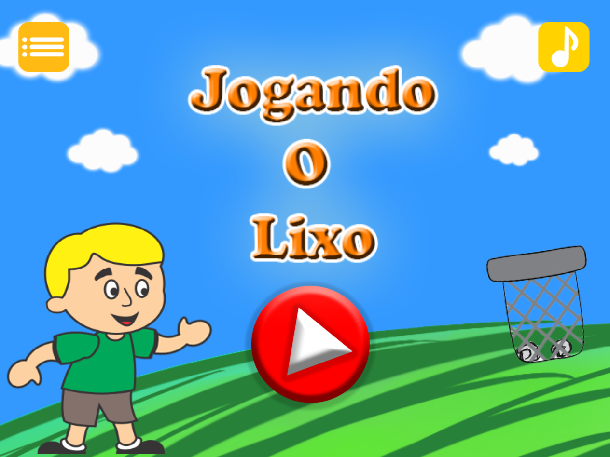
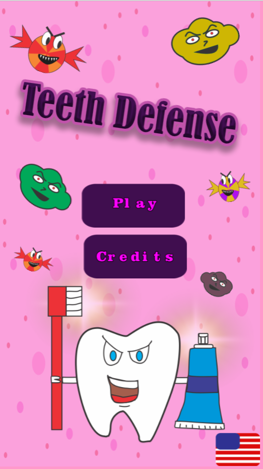
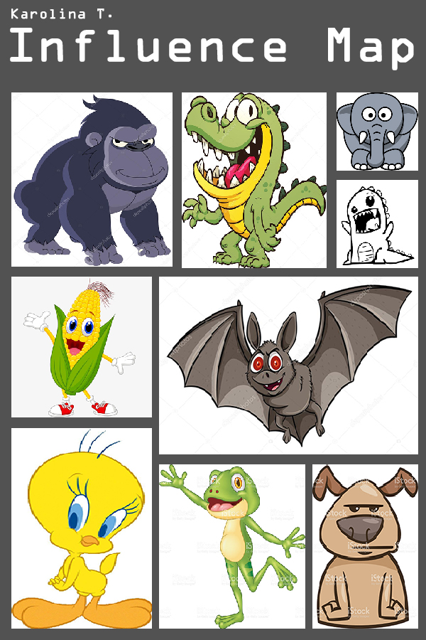
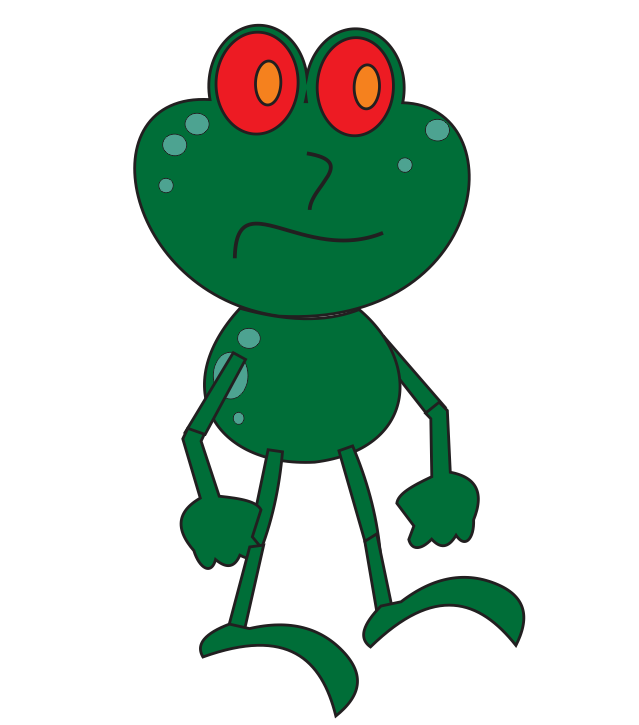
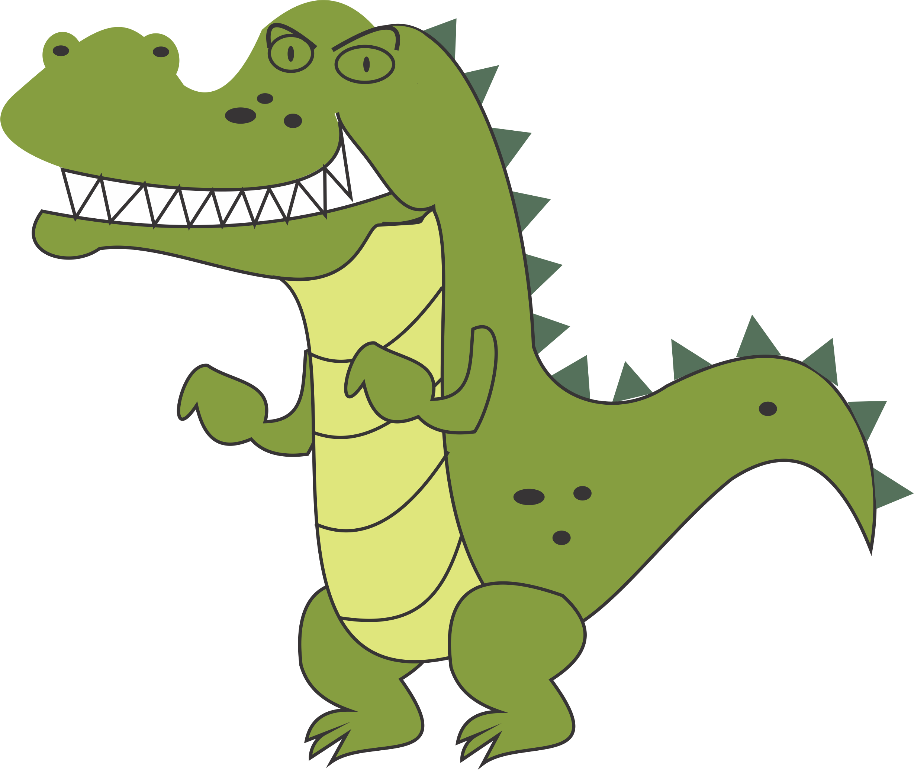
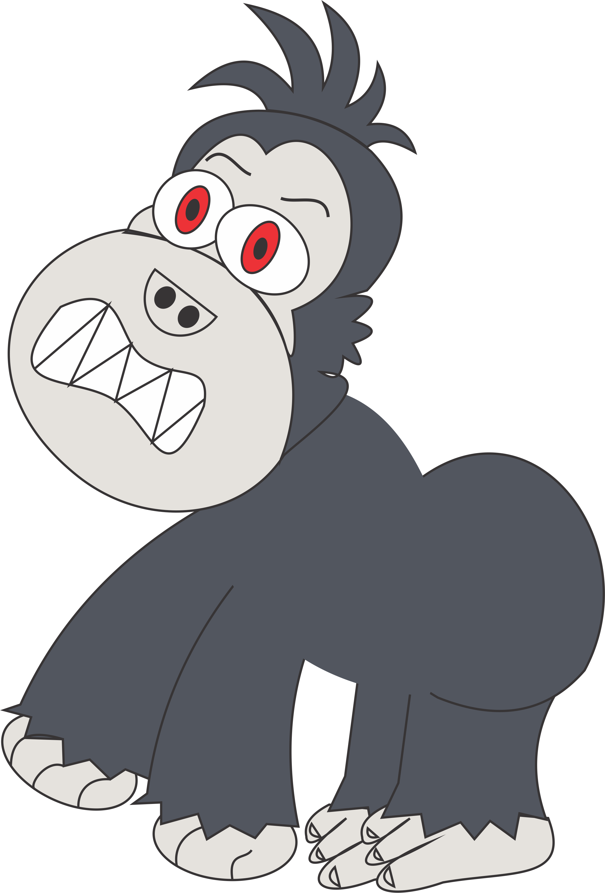
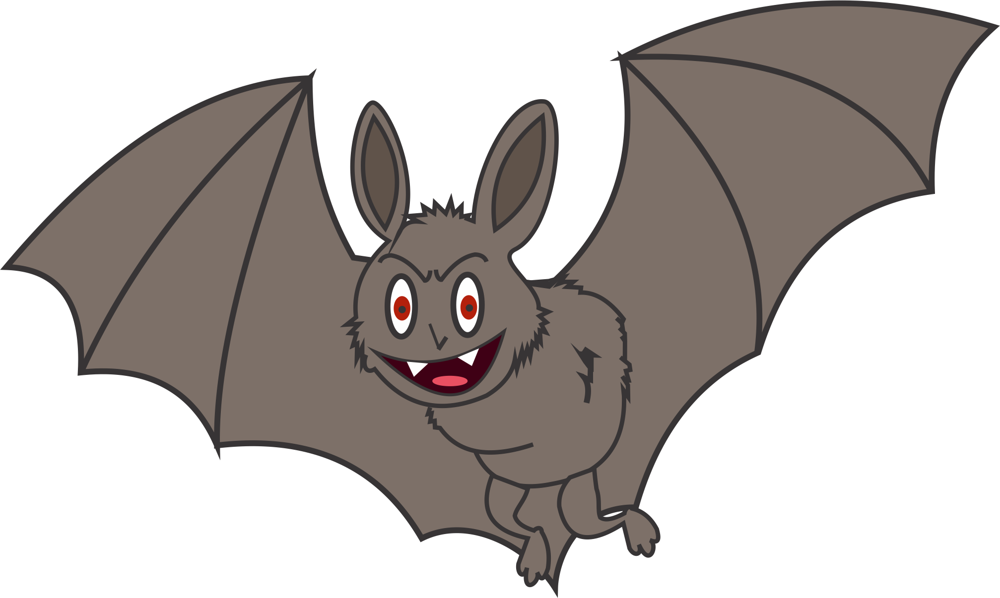

criando **minha**_pagina_~~principal~~

* * *

# Quem sou eu?  

  

 _Meu nome é karolina Trindade, tenho 18 anos e atualmente estou cursando jogos digitais no instituto IFRN._  
 _Esse portfólio tem como objetivo principal apresentar alguns dos meus trabalhos e artes desenvolvidos no curso. Espero que gostem!_
 
 
 * * *
 
# Redes sociais  

**Twitter e instagram:** @karollt2  
**Facebook:** Karol Costa  
**E-mail:** karolinatrindade3@gmail.com  

 
# portfólio

## Games  

  

  

  

  

## Artes  

**Influence Map**  

  

* * *  

_Algumas artes do jogo Cancun's temple._

  

  

  

  

  

* * *  

  
## Projetos  

  

### Aulas

* * *

# Observação:

** Negrito  
__ itálico  
~~ Riscado  
3 * linha horizontal (barra)  
#s topicos ou subtopicos   
*' adiciona lista não ordenada   
1s Criam listas ordenadas  

* * *
